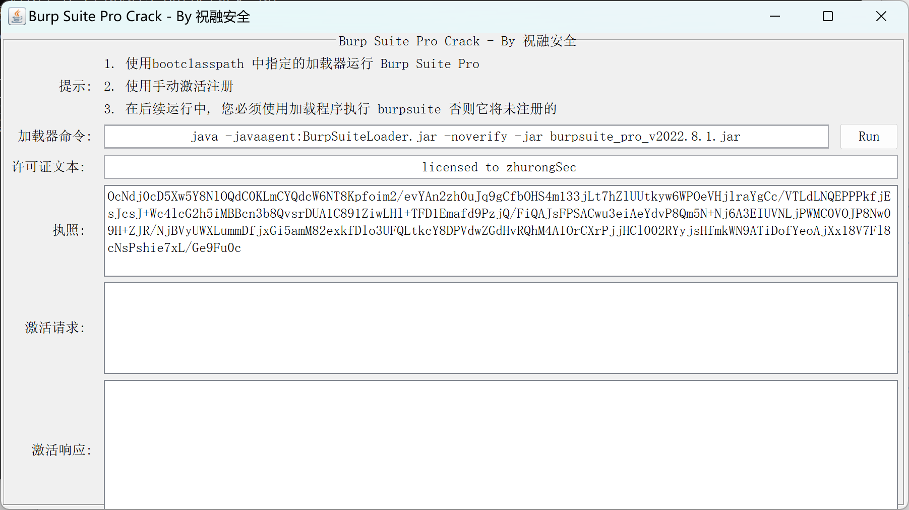

# BurpCrack
该项目仅供学习，请勿用于商业用途，有能力请支持正版

## 使用说明

BurpCrack主要由四部分组成，分别是keygen、loader、burpsuite jar包和快速启动脚本。

其中burpsuite去官网下载即可，推荐使用Stable稳定版，目前最新版是 2022.3.9。

JRE建议使用15+版本

## 安装步骤

### 1、下载并安装JDK 15+

通过 https://www.oracle.com/java/technologies/javase/jdk15-archive-downloads.html
选择 `jdk-15.0.1_windows-x64_bin.zip`

安装完成后，打开命令行，输入 

`java -version`

如果显示java版本信息，即为成功安装JDK

### 2、下载Burpsuite包

官方下载地址：

https://portswigger.net/burp/releases

https://portswigger.net/burp/releases/professional-community-2022-3-9

下载后将包名 `burpsuite_pro_v2022.3.9.jar` 改为 `burpsuite_pro.jar`

### 3、进行破解操作

运行 `BurpSuite_pro.bat` 脚本和 `BurpCrack.jar` 完成破解

## ❤️致谢

- **surferxyz** 
- <a href="https://github.com/Hywell">Hywell</a> 
- <a href="https://github.com/x-Ai/BurpSuite">x-Ai</a> 
- <a href="https://mp.weixin.qq.com/s/4KXxKdnPeWqsEsylObhg8w">scz-青衣十三楼飞花堂</a> 
